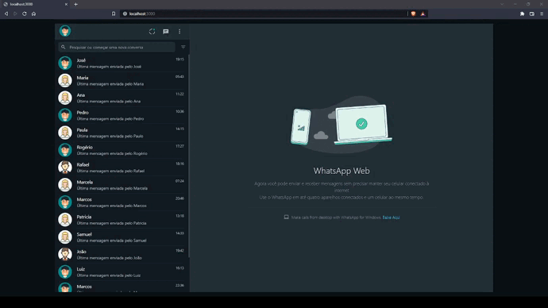

<h1 align="left">
    <a href="https://pt-br.reactjs.org/">🔗 Web WhatsApp - UI Clone</a>
</h1>
<p align="left">🚀 Web apllication (Web WhatsApp) developed using NextJS + TypeScript + TailwindCSS technologies.</p>

Running
=================

#### 🧭 Running in a browser (Frontend)

```bash

# Clone this repository
$ git clone git@github.com:wallacefreitas/web-whatsapp-ui-clone.git

# Access the folder project in your terminal/cmd
$ cd web-whatsapp-ui-clone

# Install the dependencies
$ npm install

# Run  the application in development mode
$ npm run start

# The application will open in port:3000 - go to http://localhost:3000

```
---

## 🛠 Technologies

The following tools were used in building the project:

#### **Website**  ([React JS](https://reactjs.org/)  +  [TypeScript](https://www.typescriptlang.org/))

-   **[TailwindCSS](https://tailwindcss.com/docs/guides/create-react-app)**

> See the file  [package.json](package.json)

---

## 📷 Screenshots



---

## 📝 License

This project is under license [MIT](./LICENSE.md).

Made by Wallace de Freitas 👋🏽